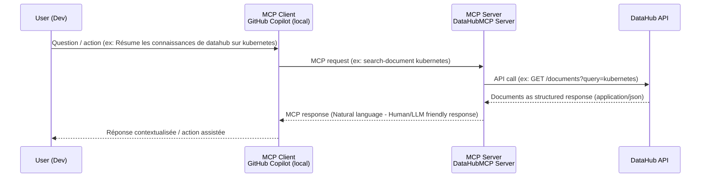

# Workshop -  Exposer une API existante à un LLM via MCP (Model Context Protocol)

Ce repository est un support de workshop pour apprendre à **mettre en place un serveur MCP** et à exposer des capacités d’une **API HTTP existante** à un assistant IA, dans un contexte réaliste de développement.


## 🎯 Objectif

L’objectif est de comprendre comment MCP agit comme une **façade sémantique** au-dessus d’une API existante, sans refonte de celle-ci.

- **Tools MCP** (actions métier appelables)
- **Resources MCP** (données internes consultables)

L’objectif est de comprendre comment MCP agit comme une **façade sémantique** au-dessus d’une API existante, sans refonte de celle-ci.


## ✅ Prérequis

- Environnement de développement **Python ou Java**
- Savoir utiliser un terminal (lancer un serveur, lire des logs)
- Notions de base : JSON, appels HTTP, fonctions / méthodes
- **GitHub Copilot activé dans VS Code**


## 📖 Contexte -  DataHub

Tu es développeur au sein de **DataHub**, une équipe qui maintient un service interne centralisant de la **documentation technique**, des **guides internes** et des **snippets utiles** pour les équipes de développement.

DataHub expose une **API HTTP existante**, utilisée par :
- les développeurs backend
- les équipes support
- les équipes data

L’API fonctionne, mais elle n’est pas conçue pour être utilisée par un LLM :
- trop de routes à connaître
- paramètres peu explicites
- aucune description exploitable automatiquement

L’équipe décide donc d’ajouter un **serveur MCP local**, indépendant de l’API, afin d’exposer uniquement les capacités utiles à un agent IA (Github Copilot).

**Architecture cible :**



## 🔌 API Endpoints -  DataHub

- `GET /health` -  Vérifier que l'API est opérationnelle
- `GET /documents` -  Lister les documents internes (filtres : tag, owner, updated_after)
- `GET /documents/{doc_id}` -  Récupérer un document complet
- `GET /search` -  Recherche texte dans les contenus (paramètres : q, scope, limit)
- `GET /snippets` -  Lister les snippets disponibles (filtres : type, service)
- `GET /snippets/{snippet_id}` -  Récupérer un snippet précis
- `GET /tags` -  Lister l'ensemble des tags utilisés
- `GET /owners` -  Lister les équipes propriétaires des documents


## 📁 Structure du projet:

```
mcp-workshop/
├── README.md                # Ce fichier
├── US 1 à US 6.md           # User Stories (exercices pratiques du workshop)
└── python/                  # Version Python du serveur MCP
└── java/                    # Version Java du serveur MCP
├── datahub_api/             # API DataHub (backend pré-existant)
```

## 📚 Ressources

- [Guide Python](python/README.md)
- [Documentation API](python/datahub_api/README.md)
- [FastMCP](https://github.com/jlowin/fastmcp)
- [MCP](https://modelcontextprotocol.io/)
